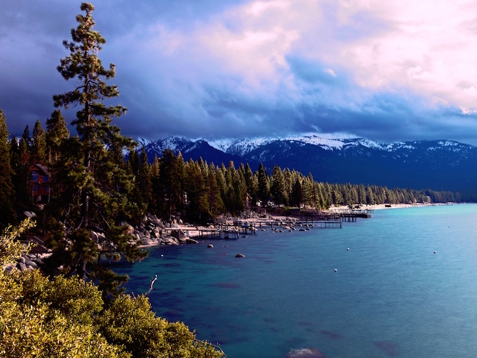
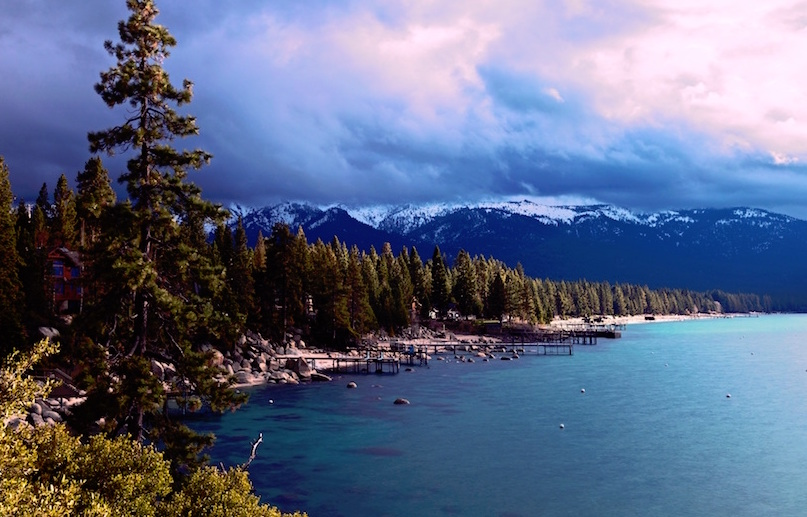

# PHPUnit Compare Images

PHPUnit assertions for assessing image similarity.

**IMPORTANT:** You may run into issues comparing different-sized images depending on your setup. I haven't been able to assess for certain what the issue is, but comparing different sized images works fine for me locally on OSX, but my tests fail in Travis CI if I use images with different sizes.

[](https://travis-ci.org/lupka/phpunit-compare-images)
[](https://packagist.org/packages/lupka/phpunit-compare-images)
[icense](https://img.shields.io/badge/license-MIT-brightgreen.svg?style=flat)](LICENSE)

## Installation

```
composer require lupka/phpunit-compare-images
```

## Usage

Add the `CompareImagesTrait` trait to your test class to enable the use of the assertions.

```php
<?php
use Lupka\PHPUnitCompareImages\CompareImagesTrait;

class YourTestCase extends PHPUnit_Framework_TestCase
{
    use CompareImagesTrait;

    ...
}
```

### Assertions

This package includes several assertions.

The first two parameters of each assertion are the images to be compared, which can either be Imagick objects or string file paths.

#### assertImageSimilarity

```
assertImageSimilarity($image1, $image2, $threshold = 0)
```

Will fail if the two images ARE NOT within the given similarity threshold.

#### assertImageDifference

```
assertImageDifference($image1, $image2, $threshold = 0)
```

Will fail if the two images ARE within the given similarity threshold.

#### assertImagesSame

```
assertImagesSame($image1, $image2)
```

Will fail if the two images ARE NOT exactly the same.

#### assertImagesDifferent

```
assertImagesDifferent($image1, $image2)
```

Will fail if the two images ARE exactly the same.

## What does $threshold mean?

The `$threshold` value on the assertImageSimilarity and assertImageDifference functions are compared directly to the result of the [compareImages function of PHP's Imagick class](http://php.net/manual/en/imagick.compareimages.php). Below our some examples of what threshold you would need to use variety of different comparisons.

##### Threshold: 0
Images are identical.




##### Threshold: 0.234
Different images.


##### Threshold: 0.033
Slightly cropped version of same image.




##### Threshold: 1
Black vs. white


## Notes/Links

* PHP.net Imagick Compare docs: http://php.net/manual/en/imagick.compareimages.php
